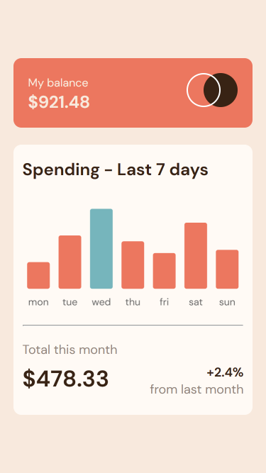

# Frontend Mentor - Expenses chart component solution

This is a solution to the [Expenses chart component challenge on Frontend Mentor](https://www.frontendmentor.io/challenges/expenses-chart-component-e7yJBUdjwt). Frontend Mentor challenges help you improve your coding skills by building realistic projects.

## Table of contents

- [Frontend Mentor - Expenses chart component solution](#frontend-mentor---expenses-chart-component-solution)
  - [Table of contents](#table-of-contents)
  - [Overview](#overview)
    - [The challenge](#the-challenge)
    - [Screenshot](#screenshot)
    - [Links](#links)
  - [My process](#my-process)
    - [Built with](#built-with)
    - [What I learned](#what-i-learned)
    - [Useful resources](#useful-resources)
  - [Author](#author)

## Overview

### The challenge

Users should be able to:

-   View the bar chart and hover over the individual bars to see the correct amounts for each day
-   See the current day’s bar highlighted in a different colour to the other bars
-   View the optimal layout for the content depending on their device’s screen size
-   See hover states for all interactive elements on the page
-   **Bonus**: Use the JSON data file provided to dynamically size the bars on the chart

### Screenshot

-   Desktop view
    

-   Mobile view
    

### Links

-   Solution URL: [Github](https://github.com/ChinatuL/Expenses-Chart-Component)
-   Live Site URL: [Live Site](https://chinatul.github.io/Expenses-Chart-Component/)

## My process

### Built with

-   Semantic HTML5 markup
-   CSS custom properties
-   Flexbox
-   SCSS
-   Mobile-first workflow
-   [Chart.js](https://www.chartjs.org/) - JS library

### What I learned

-   Integration of a JavaScript library using CDN.

```html
<script src="https://cdn.jsdelivr.net/npm/chart.js@4.2.1/dist/chart.umd.min.js"></script>
```

-   Building and customization of bar chart with [Chart.js](https://www.chartjs.org/)

```js
const myChart = new Chart(
    document.getElementById("myChart").getContext("2d"),
    config
);
```

### Useful resources

-   [Build a bar chart with Chart.js](https://www.chartjs.org/docs/latest/) - Documentation for Chart.js library

## Author

-   Frontend Mentor - [@ChinatuL](https://www.frontendmentor.io/profile/ChinatuL)
-   Twitter - [@ChinatuLucia](https://www.twitter.com/ChinatuLucia)
